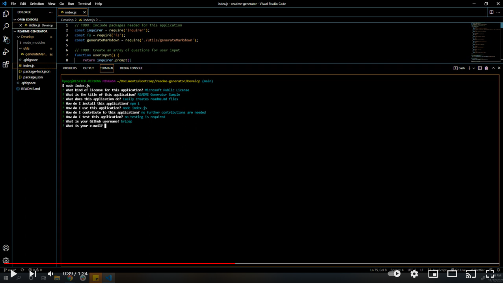
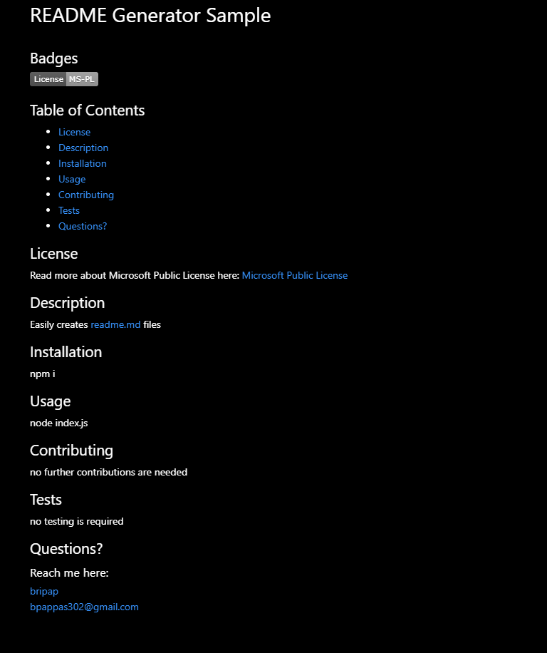

# 09 Node.js Homework: Professional README Generator

## Task:
Create an command-line application that allows user to quickly and easily create a professional README file, allowing the project creator to devote more time to working on the actual project.

## Walk-through video:

[Click to watch example walk-through video](https://youtu.be/o1iu9sgVEDM)

## Image of sample README.mf file that was generated by application:

## Contact Me:
 [Github](https://github.com/bripap)  

